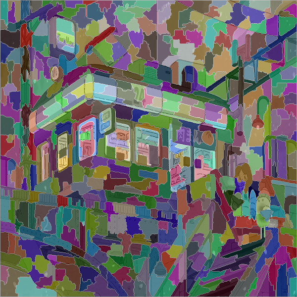
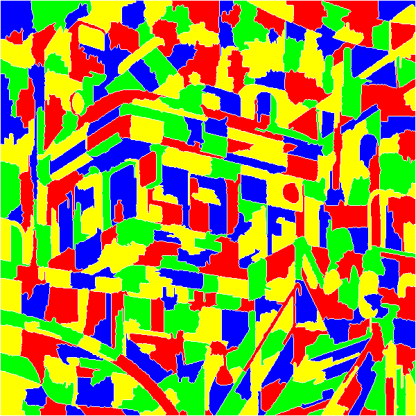
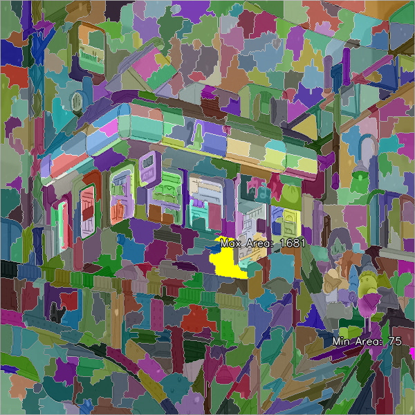
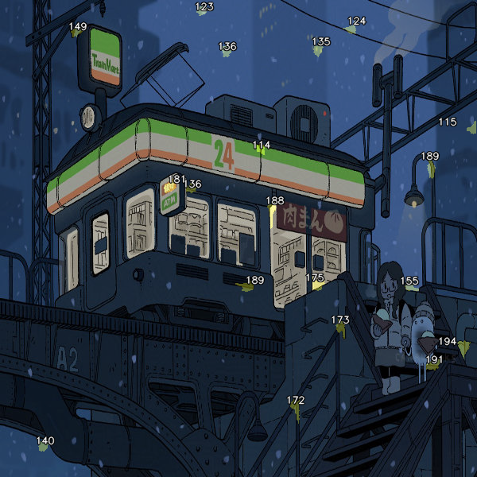
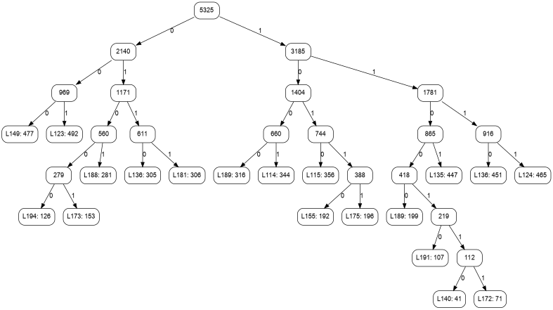
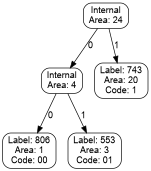

<!-- # 封面


- 学校和学院LOGO
- 报告标题
- 院系
- 专业和班级
- 学号
- 姓名
- 指导老师
- 提交时间 -->

<!-- # 目录

1. [问题描述](#问题描述)
2. [算法设计](#算法设计)
3. [测试分析](#测试分析)
4. [总结展望](#总结展望)
5. [附录](#附录) -->

# 问题描述

## 实验任务

<!-- 详细描述需要完成的任务。 -->

开发程序实现以下功能

输入：任意一张M*N的彩色图片

使用OpenCV库，使用纯C语言或者C/C++语言

## 任务一 均匀随机采样

使用基于种子标记的分水岭算法（OpenCV自带watershed）对输入图像进行过分割

用户输入图像和整数K，要求程序自动计算K个随机种子点，确保各种子点之间的距离均 > (M*N/K)0.5（参考泊松圆盘采样+贪心策略）

然后让程序在原图中标出各种子点的位置及编号，并采用半透明+随机着色的方式给出分水岭算法的可视化结果

## 任务二 四原图着色

使用邻接表统计分水岭结果中各区域的邻接关系

并采用四原色法（合理选择初始着色区域，并基于图的广度优先遍历，采用队列对其他待着色区域进行着色顺利梳理，加速全图着色过程）

对分水岭结果重新着色（使用堆栈+回溯策略，优化回退率）

## 任务三 排序查找+哈夫曼

根据分水岭结果中各区域面积大小的“堆排序”结果，提示最大和最小面积，

用户输入查找范围（面积下界和上界），使用折半查找，程序对所有符合要求的分水岭结果（标记区域面积）进行突出显示

并以这些高亮区域的面积大小作为权值，进行哈夫曼编码（考虑深度+递归策略），绘制该哈夫曼树

## 规范要求

实验的指导方针和约束条件。

- 学习使用STL标准模板库和OpenCV基本数据格式
- 少用静态数组，多用指针和动态内存分配/释放
- 对源码中文件、函数进行合理划分，保证模块独立性
- 函数、变量、常量等命名规范（去汉语拼音）
- 文件、函数宏观注释，核心变量、程序段微观注释
- 对输入进行合法性校验和功能、容错提示
- 尽量优化算法，确保稳定性及低时空复杂度
- 设计和优化Demo的交互逻辑及可视化UI

## 编程环境

开发所使用的工具和平台。

```txt
OS: Kubuntu 24.04.2 LTS x86_64 
vscode 1.97.2
opencv 4.12.0-dev
remote host: github (https://github.com/kriss-spy/opencv-course-lab)
```

<!-- Host: 21LE ThinkBook 16 G6+ IMH 
Kernel: 6.11.0-17-generic 
DE: Plasma 5.27.12 
CPU: Intel Ultra 9 185H (22) @ 4.800GHz 
GPU: NVIDIA GeForce RTX 4060 Max-Q / Mobile 
GPU: Intel Arc Graphics -->

## 测试数据

fruits.jpg... in opencv-watershed/image/

## 评价指标

<!-- 评估算法性能的标准。 -->


> 对于 600*600 左右分辨率的图片，在基本任务（数据结构和算法）和功能（提示、交互逻辑及可视化 UI）都能实现的前提下，给出如下分类评价，介于其间较远者，给出对应的“+”或“-”评价结论；如果基本要求都没有实现或者实现不够完整，该任务不予验收：
>
> 任务 1：均匀随机采样 
>
> A  K=1000 时，产生的随机点数大于 1000，程序用时 1s 以内
>
> B  K=500 时，产生的随机点数大于 500，程序用时 0.5s 以内
>
> C  K=100 时，产生的随机点数大于 100，程序用时 0.2s 以内
>
> 任务 2：四原图着色
>
> A  K=1000 时，失败率低于 40%，程序用时 4s 以内
>
> B  K=500 时，失败率低于 20%，程序用时 2s 以内
>
> C  K=100 时，失败率低于 10%，程序用时 0.5s 以内
>
> 任务 3：排序查找+哈夫曼
>
> A  K=1000 时，用时 1s 以内，完成折半查找和递归哈夫曼编码，可视化符合要求，其中哈夫曼树的绘制，满足深度右倾、横向分布均匀、编码标记清晰
>
> B  K=500 时，用时 0.5s 以内，完成折半查找和递归哈夫曼编码，可视化、容错处理、相关信息提示效果尚可
>
> C  K=100 时，用时 0.1s 以内，完成折半查找和递归哈夫曼编码，可视化、容错处理、相关信息提示效果不够清晰美观
>

# 算法设计

## 破题原理分析
<!-- 解释基本原理和理论。 -->

基于opencv框架和既有的demo程序
分步实现三个不同的任务

### task1
核心问题是如何在图像中随机取k个点，保证最小距离大于sqrt(M*N/k)。
采样算法种类繁多，包括泊松圆盘采样，抖动网格采样等。[@2DPointSets]
因六边形网格法理论上采样点上限较高，首先构建六边形网格作为框架，再随机采样K种子点。

### task2
算法需要处理的数据为区域的邻接关系

运用四原色法

采用队列

搜索可行的着色方案，实现对分水岭结果重新着色

### task3
对区域面积进行堆排序[@Heapsort2025]

折半查找用户输入的区间下界和上届

对区间的的面积数据，构建哈夫曼树[@HuffmanCoding2025]，并可视化

## 整体架构设计

系统架构的高层设计。

以既有的鼠标绘制分水岭demo程序为基础，分别编写task1/2/3对应程序。
每个任务的特定功能和算法，在不同的文件分别实现。多个任务需要用到的功能，在一个文件里共用。
项目使用make构建，最终在build文件夹得到可执行程序。

```txt
├── build                   // executable program
├── cv2-watershed-copy.cpp  // original demo program
├── doc
├── image                   // input image
│   └── fruits.jpg
├── Makefile                // compile project
├── sample.h                // sampling
├── task1.cpp               // task1 program
├── task2.cpp               // task2 program
├── task3.cpp               // task3 program
└── watershed_utils.h       // common utils, helper functions
```

## 算法逻辑设计

<!-- 详细的算法逻辑设计。 -->

### task1

任务一的核心目标是对输入图像进行过分割，并通过均匀随机采样自动生成K个种子点，这些种子点将作为分水岭算法的标记。算法设计主要包含种子点生成、应用分水岭算法和结果可视化三个主要阶段。

**种子点生成策略**方面，为了在图像上生成K个分布相对均匀且满足最小距离约束的种子点，本项目结合了抖动六边形网格采样和贪心选择策略。首先，根据图像尺寸(M, N)和目标种子点数量K，计算一个合适的六边形单元边长，构建覆盖整个图像的基础六边形网格。选择六边形网格是因为其较高的填充效率和良好的各向同性。随后，为了引入随机性并避免过于规律的采样，对每个六边形格点的位置进行轻微的随机扰动，即将其坐标(x, y)移动一个小范围内的随机偏移量(dx, dy)。最后，通过贪心选择实现最小距离约束。设定最小距离阈值d_min = sqrt(M*N/K)，并随机打乱候选点列表顺序。初始化一个空的种子点集合S，遍历打乱后的候选点列表，对于每个候选点p，若其与S中所有已选种子点的距离均大于d_min，则将p加入S。此过程重复直至选出K个种子点，或遍历完所有候选点。若点数不足K，可能需调整初始网格密度或抖动范围。

o在**应用分水岭算法**阶段，选出的K个种子点将作为标记（markers）输入到OpenCV的 `watershed()` 函数。为此，会创建一个与原图等大的标记矩阵，其中每个种子点的位置被赋予一个从1到K的唯一正整数标签，其余像素则初始化为0。分水岭算法依据这些标记及图像的梯度信息，将图像分割成对应各个种子点的不同区域。

至于**结果可视化**，首先会在原始图像的副本上，使用小圆圈或十字等明显标记标出K个种子点的位置，并在旁边显示其编号。接着，为了清晰展示分割效果，会为K个分割区域（不包括背景和边界）分别赋予一个随机生成的颜色。这些颜色将以半透明的方式叠加到原始图像上。分水岭算法形成的边界（在标记矩阵中通常用-1表示）可以使用特殊颜色（如白色或黑色）进行高亮显示，从而形成最终的可视化结果。

该整体方法旨在平衡种子点分布的均匀性、随机性以及用户指定的数量K，同时确保种子点之间有足够的间隔，为分水岭算法提供良好的初始分割依据。

### task2

任务二的核心目标是利用四色定理对分水岭算法分割出的区域进行着色。算法主要包含邻接关系构建和图着色两个主要阶段。

首先，在**邻接关系构建**阶段，程序会遍历分水岭算法输出的标记矩阵（`markers`图像）。对每个像素，它会检查其四邻域或八邻域的像素。如果发现相邻像素属于不同的分割区域（即它们具有不同的标记ID），则记录这两个区域是相邻的。为了高效存储并避免重复记录，本项目采用邻接表（具体实现为 `std::vector<std::set<int>>`）来保存区域间的邻接关系。在这种结构中，每个区域ID对应一个集合，该集合内存储所有与之直接相邻的区域ID。

接下来是**图着色算法**阶段。准备四种预定义的颜色（例如，编号0、1、2、3），并创建一个数组或映射来存储每个区域最终被分配的颜色，初始时所有区域均标记为未着色。着色顺序采用广度优先搜索（BFS）策略。可以选择一个未着色的区域作为起点（例如，面积最大或邻居最多的区域，或简单地从ID为0的区域开始），并将其加入队列。当从队列中取出一个区域时，算法会尝试为其分配一种有效颜色。一种颜色被认为是有效的，前提是它没有被任何已着色的相邻区域使用。算法会遍历四种预定义颜色，选择第一个满足此条件的颜色分配给当前区域。如果当前区域无法使用任何可用颜色（即所有四种颜色均已被其至少一个已着色的邻居占用），则表明之前的颜色选择导致了冲突。为了处理这类着色冲突并提高成功率，引入了回溯机制。这通常通过递归函数实现，该函数维护当前的着色状态。如果一个区域无法被成功着色，算法会回溯到前一个（或相关的）已着色区域，尝试为该区域分配另一种不同的有效颜色，然后再次尝试为后续区域着色。可以使用栈（显式地或通过递归调用栈隐式地实现）来管理决策点，以便在发生冲突时能够有效地回退并尝试其他颜色组合。新着色的区域的未着色邻居会被加入队列，整个过程持续进行，直到所有区域都被成功着色，或者已尝试所有可能性仍无法完成着色。

这种结合了BFS有序遍历和回溯灵活性的方法，旨在高效地找到一个有效的四色方案。

### task3

任务三旨在对分水岭算法分割得到的区域，根据其面积进行分析和编码。整个流程主要包括区域面积统计与排序、基于面积范围的区域查找与高亮显示，以及哈夫曼编码与树的可视化三个核心步骤。

首先，在**区域面积统计与排序**阶段，程序会遍历分水岭算法输出的标记矩阵（`markers`图像），以计算每个独立分割区域的面积，即该区域包含的像素数量。这些区域ID及其对应的面积会被存储起来，例如使用 `std::vector<std::pair<int, int>>` 的数据结构，其中每个元素记录一个 `{区域ID, 面积}` 对。完成面积统计后，程序将采用堆排序（Heap Sort）算法对所有区域按面积进行排序（升序或降序）。选择堆排序是因为它能提供较好的平均及最坏情况下的时间复杂度（O(n log n)）。排序完成后，程序能够直接获取并向用户提示面积最大和最小的区域及其具体的面积值。

接下来是**基于面积范围的区域查找与高亮**阶段。用户将被提示输入一个面积范围，包括下限（min_area）和上限（max_area）。程序会在已按面积排序的区域列表中，利用折半查找（Binary Search）算法（或C++ STL中的 `std::lower_bound` 和 `std::upper_bound` 函数）来高效地定位所有面积在此指定范围内的区域。查找到的这些符合条件的区域随后会在原始图像或分割结果图像上被突出显示，例如通过应用特定的颜色或叠加半透明蒙版。

最后是**哈夫曼编码与树的可视化**阶段。在上一步筛选出的、面积在指定范围内的区域，其各自的面积大小将被用作构建哈夫曼树时的权值（或称频率）。哈夫曼树的构建过程通常借助优先队列（最小堆）来实现：初始时，为每个待编码的区域（及其权值）创建一个叶节点，并将所有这些叶节点加入优先队列。当队列中存在多于一个节点时，重复从队列中取出两个权值最小的节点（它们将成为新节点的左右子节点），然后创建一个新的内部节点，其权值为这两个子节点权值之和，并将这个新创建的内部节点重新加入优先队列。此过程持续进行，直到队列中仅剩下一个节点，该节点即为哈夫曼树的根节点。哈夫曼编码本身则通过从根节点递归遍历哈夫曼树来生成：通常约定向左子树的路径分配编码 \'0\'，向右子树的路径分配编码 \'1\'。当遍历到达一个叶节点时，从根节点到该叶节点所经过的路径编码序列，即构成了该叶节点对应区域的哈夫曼编码。为了实现哈夫曼树的可视化，程序会将构建好的哈夫曼树结构输出为DOT语言格式的文本文件。随后，可以调用Graphviz工具集中的 `dot` 命令，将此DOT文件转换为图像格式（如PNG）。在进行可视化时，会特别注意树的布局，力求满足“深度右倾、横向分布均匀、编码标记清晰”等要求，以增强结果的可读性和专业性。

此流程通过结合高效的排序、查找算法与经典的哈夫曼编码技术，实现了对图像分割区域的多维度分析和有效的信息压缩表示。

## 数据结构设计

本项目在实现各项功能时，主要利用了以下数据结构：

1. **`cv::Mat` (OpenCV 矩阵)**:
   - **用途**：存储和操作图像数据（原始图像、灰度图像、标记矩阵 `markers`、分水岭结果可视化图像 `wshed` 等）。OpenCV的核心数据结构，用于高效处理像素数据。
   - **说明**：`markers` 矩阵尤为重要，它是一个与原图等大的单通道32位整型矩阵（`CV_32S`），其中每个像素值代表其所属的分割区域ID（0通常表示背景或未定义，-1表示分水岭边界，正数表示具体的区域标签）。

2. **`std::vector<cv::Point>` (点向量)**:
   - **用途**：存储种子点坐标（Task 1）。`cv::Point` 是OpenCV中表示二维坐标点（x, y）的结构。

3. **`std::vector<std::vector<int>>` 或 `std::vector<std::set<int>>` (邻接表)**:
   - **用途**：表示区域间的邻接关系（Task 2）。
   - **`std::vector<std::vector<int>>`**：外层vector的索引代表区域ID，内层vector存储该区域所有邻接区域的ID。可能存在重复邻接关系，查询特定邻接关系效率较低。
   - **`std::vector<std::set<int>>`**：更优选择。外层vector索引代表区域ID，内层 `std::set` 存储邻接区域ID，自动去重且方便查找（O(log N)）。

4. **`std::vector<int>` (颜色向量/状态向量)**:
   - **用途**：存储每个区域分配到的颜色（Task 2，索引为区域ID，值为颜色编号）或记录区域的访问状态（如图着色过程中的已访问、未访问）。

5. **`std::queue<int>` (队列)**:
   - **用途**：实现广度优先搜索（BFS）算法，用于图着色过程中的区域遍历顺序管理（Task 2）。

6. **`std::stack<State>` (栈)**:
   - **用途**：实现回溯算法，用于图着色过程中的状态保存与恢复（Task 2）。`State` 可以是一个自定义结构体，包含当前着色进度、已做决策等信息。

7. **`std::vector<std::pair<int, int>>` (区域面积向量)**:
   - **用途**：存储每个区域的ID及其对应的面积（Task 3）。`std::pair<int, int>` 中，`first` 可以是区域ID，`second` 是面积，或者反之，根据排序和查找需求决定。

8. **自定义 `HuffmanNode` 结构体/类 (哈夫曼树节点)**:
   - **用途**：构建哈夫曼树（Task 3）。
   - **成员**:
     - `int label`：区域ID（仅叶节点有效，内部节点可设为-1）。
     - `int area`：区域面积（作为频率/权值）。
     - `HuffmanNode *left`：指向左子节点的指针。
     - `HuffmanNode *right`：指向右子节点的指针。
     - （可选）`std::string code`：存储该节点（如果是叶节点）的哈夫曼编码。

9. **`std::priority_queue<HuffmanNode*, std::vector<HuffmanNode*>, CompareNodes>` (优先队列)**:
   - **用途**：辅助构建哈夫曼树（Task 3）。`CompareNodes` 是一个自定义比较器，用于实现最小堆（按节点面积/权值排序）。

10. **`std::map<int, std::string>` (哈夫曼编码表)**:
    - **用途**：存储每个区域ID（`int`）到其对应哈夫曼编码（`std::string`）的映射（Task 3）。

11. **`std::vector<cv::Vec3b>` (颜色查找表)**:
    - **用途**：存储用于可视化分水岭区域的随机颜色或预定义颜色（Task 1, Task 2）。`cv::Vec3b` 表示BGR颜色。

这些数据结构的选择旨在平衡功能实现、效率和OpenCV库的兼容性。

## 创新思路总结

<!-- 实现的创新方法或思路总结。 -->
### 任务一：均匀随机采样

- **抖动六边形网格采样 (Jittered Hexagonal Grid Sampling)**：摒弃纯粹的随机播种或简单的正交网格采样，本项目创新性地采用六边形网格作为初始采样框架。六边形网格在理论上能以最高的填充效率覆盖二维平面，确保了种子点在初始阶段就具有较好的空间分布均匀性。
- **贪心策略优化最小距离**: 在六边形网格初步采样后，结合贪心算法确保种子点间的最小距离约束（类泊松盘采样思想）。具体而言，从候选点中迭代选择符合最小距离要求的点，若一个点与已选所有种子点的距离均大于阈值 `(M*N/K)^0.5`，则将其加入种子点集。这种方法旨在平衡采样点分布的均匀性、随机性以及计算效率，尤其在K值较大时，能有效避免点堆叠，生成视觉上更自然的采样结果。
- **效率与效果的平衡**：通过预先划分六边形格网，缩小了随机选择的范围，再结合贪心距离检查，相较于纯粹的暴力搜索或复杂的泊松盘生成算法，在保证采样质量的同时，显著提高了生成K个种子点的计算效率。

### 任务二：四色图着色

- **启发式BFS与回溯优化**：
  - **起始节点选择**：在进行广度优先搜索（BFS）确定着色顺序时，并非随机选取起始区域，而是优先选择图中度数最大（邻接区域最多）的区域开始着色。理论上，优先处理约束最强的节点有助于尽早发现潜在冲突，减少后续的回溯深度。
  - **颜色选择策略**：为区域选择颜色时，尝试维持颜色的使用均衡性，或优先选择使用次数最少的颜色，以期为后续区域保留更多选择。
  - **智能回溯**：当发生着色冲突时，回溯机制不仅是简单地返回上一区域尝试不同颜色，而是可以结合启发式信息，例如优先调整导致冲突的关键区域的颜色，或者尝试改变冲突链条上自由度较高（可选颜色较多）的区域的颜色。
- **邻接关系的高效构建与存储**：使用 `std::vector<std::set<int>>` 作为邻接表的数据结构。`std::set` 自动处理了重复邻接关系（例如，两个区域共享多个边界像素段），并保持邻接ID有序，这有助于调试和某些特定分析，同时也简化了邻接判断逻辑。

### 任务三：排序查找与哈夫曼编码

- **集成化处理流程与动态可视化**：
  - **一站式数据处理**：将分水岭区域的面积计算、基于面积的堆排序、用户定义范围的高效二分查找、以及针对选中区域面积的哈夫曼编码与树的可视化，整合成一个连贯的操作流程。
  - **动态哈夫曼树生成与美化**：哈夫曼树的构建不仅是算法实现，更注重其可视化效果。程序动态生成Graphviz的DOT语言描述，然后调用Graphviz工具渲染出图像。特别注意了树的布局，使其满足“深度右倾、横向分布均匀、编码标记清晰”的要求，增强了结果的可读性和专业性。
- **高效的区域面积统计与查找**：
  - **单遍面积统计**：通过一次遍历标记矩阵（`markers`图像），即可统计出所有分割区域的精确面积，避免了重复计算。
  - **二分查找优化**：在堆排序后的有序面积列表上，采用二分查找算法来快速定位用户指定面积范围内的区域，显著提高了大规模区域集合下的查找效率。
- **用户交互与反馈**：程序不仅执行算法，还提供了清晰的用户交互提示，如最大最小面积、查找范围输入引导，并对查找到的区域在原图或分割图上进行高亮显示，增强了用户体验。

# 测试分析

## 测试目的

验证程序各个模块及整体功能的正确性、稳定性和性能表现。

## 测试环境

- 操作系统：Kubuntu 24.04.2 LTS x86_64
- 开发工具：vscode 1.97.2
- OpenCV版本：4.12.0-dev
- 测试图像：`image/fruits.jpg`（分辨率约600x600）

## 测试分类

1. **功能测试**：验证各个任务（均匀随机采样、四原图着色、排序查找+哈夫曼）的基本功能是否正常。
2. **性能测试**：评估程序在不同规模（K值、图像尺寸）下的运行时间和资源消耗。
3. **稳定性测试**：长时间运行或对大量数据反复操作，观察程序是否稳定，是否有内存泄漏等问题。
4. **边界情况测试**：输入一些边界值或特殊值，验证程序的健壮性，如K=1、K=M*N、空图像等。
5. **合法性测试**：关注程序对无效输入、异常情况及边界条件的容错能力和处理逻辑。

## 测试用例

## 常规测试

<!-- 常规测试旨在验证程序在典型场景下的基本功能和主要逻辑的正确性。 -->
<!-- 常规测试的通过是后续更复杂测试的基础，确保了核心功能的稳定可靠。 -->

### 常规测试 - 任务一：均匀随机采样
K=500
```txt
✅ Seed generation time cost = 0.74 ms
Found 500 contours for watershed
🐞 Number of contours found in markers: 500
🐞 Markers minVal: 0, maxVal: 500
watershed exec time = 13.5976ms
```




### 常规测试 - 任务二：四色图着色

K=300
```txt
Adjacency list build time = 77.2734ms
Four-coloring time = 0.12086ms
Color distribution:
RED: 77 regions
YELLOW: 80 regions
GREEN: 70 regions
BLUE: 73 regions
ℹ️ Visualized 300 regions with seed points in window 'four color result'
Four-coloring verification: PASSED
```



### 常规测试 - 任务三：排序查找与哈夫曼编码

K=500
```txt
getting area values...
min area: 75 (label 63)
max area: 1681 (label 177)
Highlighted min area region (Label: 63) in 'watershed transform' window.
Highlighted max area region (Label: 177) in 'watershed transform' window.
```



```txt
Please input the lower bound for area search.
ℹ️ Min recorded area is 75. Example: 75
Lower bound > Please input a lower bound!
Lower bound > 100
Please input the upper bound for area search.
ℹ️ Max recorded area is 1681. Example: 1681
Upper bound > 200
Searching for regions with area between 100 and 200
Found 19 regions within the range.
Highlighted regions are shown in 'Search Area Value Range' window.

Performing Huffman Coding for regions in range...

Attempting to generate Huffman tree image using Graphviz...
Huffman tree image 'huffman_tree.png' generated and displayed.
Close the 'Huffman Tree' window to exit or continue.
```




## 性能测试
<!-- 性能测试主要评估程序在处理大规模数据时的效率和资源消耗情况。
性能测试确保了程序在实际应用中能够高效稳定地运行，满足实时或准实时处理的需求。 -->

### task1
K=1000
```txt
Image size: 600x600 pixels
Please input k (number of random seed points, e.g., 100, 500, 1000). Range: [1, 5000]
> 1000
Please input temperature (e.g., 0.0 to 1.0). Press enter to use default: 0.01
> 
ℹ️ Using default temperature: 0.01
QSettings::value: Empty key passed
QSettings::value: Empty key passed
ℹ️ Generating seed points...
ℹ️ Offset try 1: found 986 candidates
ℹ️ Offset try 5: found 1003 candidates
ℹ️ Hex sampler: generated 1000 points, min-distance 18.974 px
✅ Seed generation time cost = 0.50 ms
Found 1000 contours for watershed
watershed exec time = 10.6721ms
ℹ️ Generating seed points...
ℹ️ Offset try 1: found 1003 candidates
ℹ️ Hex sampler: generated 1000 points, min-distance 18.974 px
✅ Seed generation time cost = 0.31 ms
Found 1000 contours for watershed
watershed exec time = 10.7746ms
```
### task2

经过测试，四色方案搜索用时满足要求
成功率有欠缺

### task3
K=1000
用时满足要求
```txt
Please input k (number of random seed points, e.g., 100, 500, 1000). Range: [1, 5000]
> 1000
Please input temperature (e.g., 0.0 to 1.0). Press enter to use default: 0.01
> 
ℹ️ Using default temperature: 0.01
QSettings::value: Empty key passed
QSettings::value: Empty key passed
ℹ️ Generating seed points...
ℹ️ Offset try 1: found 986 candidates
ℹ️ Offset try 4: found 1003 candidates
ℹ️ Hex sampler: generated 1000 points, min-distance 18.974 px
✅ Seed generation time cost = 0.50 ms
Found 1000 contours for watershed
watershed exec time = 12.4808ms
getting area values...
min area: 85 (label 30)
max area: 754 (label 726)
Highlighted min area region (Label: 30) in 'watershed transform' window.
Highlighted max area region (Label: 726) in 'watershed transform' window.
Please input the lower bound for area search.
ℹ️ Min recorded area is 85. Example: 85
Lower bound > 100 
Please input the upper bound for area search.
ℹ️ Max recorded area is 754. Example: 754
Upper bound > 300
Searching for regions with area between 100 and 300
Found 462 regions within the range.
Highlighted regions are shown in 'Search Area Value Range' window.

Performing Huffman Coding for regions in range...
Huffman tree building time: 0.070739 ms

Attempting to generate Huffman tree image using Graphviz...
Huffman tree image 'huffman_tree.png' generated and displayed.
Close the 'Huffman Tree' window to exit or continue.
```

## 稳定性测试
### task1
K=1000时，能够稳定生成1000个种子点

```txt
Please input k (number of random seed points, e.g., 100, 500, 1000). Range: [1, 5000]
> 1000
Please input temperature (e.g., 0.0 to 1.0). Press enter to use default: 0.01
> 
ℹ️ Using default temperature: 0.01
QSettings::value: Empty key passed
QSettings::value: Empty key passed
ℹ️ Generating seed points...
ℹ️ Offset try 1: found 986 candidates
ℹ️ Offset try 2: found 1003 candidates
ℹ️ Hex sampler: generated 1000 points, min-distance 18.974 px
✅ Seed generation time cost = 0.40 ms
ℹ️ Visualized 1000 seed points in window 'image'
ℹ️ Generating seed points...
ℹ️ Offset try 1: found 1003 candidates
ℹ️ Hex sampler: generated 1000 points, min-distance 18.974 px
✅ Seed generation time cost = 0.22 ms
ℹ️ Visualized 1000 seed points in window 'image'
ℹ️ Generating seed points...
ℹ️ Offset try 1: found 1003 candidates
ℹ️ Hex sampler: generated 1000 points, min-distance 18.974 px
✅ Seed generation time cost = 0.31 ms
ℹ️ Visualized 1000 seed points in window 'image'
ℹ️ Generating seed points...
ℹ️ Offset try 1: found 986 candidates
ℹ️ Offset try 2: found 1003 candidates
ℹ️ Hex sampler: generated 1000 points, min-distance 18.974 px
✅ Seed generation time cost = 0.42 ms
ℹ️ Visualized 1000 seed points in window 'image'
```

### task2
K=500，成功率约为40%，用时低于2s
```
Total regions for four-coloring: 500
Adjacency list build time = 125.879ms
Four-coloring time = 0.297333ms
Color distribution:
RED: 131 regions
YELLOW: 129 regions
GREEN: 123 regions
BLUE: 117 regions
Four-coloring verification: PASSED
```

K=100，失败率低于10%，用时低于0.5s
```
Total regions for four-coloring: 100
Adjacency list build time = 29.2104ms
Four-coloring time = 0.041375ms
Color distribution:
RED: 30 regions
YELLOW: 27 regions
GREEN: 22 regions
BLUE: 21 regions
Four-coloring verification: PASSED
```
### task3
K=1000，用时满足要求

```
Found 1000 contours for watershed
watershed exec time = 12.4808ms
getting area values...
min area: 85 (label 30)
max area: 754 (label 726)
Highlighted min area region (Label: 30) in 'watershed transform' window.
Highlighted max area region (Label: 726) in 'watershed transform' window.
Please input the lower bound for area search.
ℹ️ Min recorded area is 85. Example: 85
Lower bound > 100 
Please input the upper bound for area search.
ℹ️ Max recorded area is 754. Example: 754
Upper bound > 300
Searching for regions with area between 100 and 300
Found 462 regions within the range.
Highlighted regions are shown in 'Search Area Value Range' window.

Performing Huffman Coding for regions in range...
Huffman tree building time: 0.070739 ms

Attempting to generate Huffman tree image using Graphviz...
Huffman tree image 'huffman_tree.png' generated and displayed.
Close the 'Huffman Tree' window to exit or continue.
ℹ️ Generating seed points...
ℹ️ Offset try 1: found 1003 candidates
ℹ️ Hex sampler: generated 1000 points, min-distance 18.974 px
✅ Seed generation time cost = 0.14 ms
ℹ️ Visualized 1000 seed points in window 'image'
Found 1000 contours for watershed
watershed exec time = 15.1791ms
getting area values...
min area: 69 (label 499)
max area: 914 (label 387)
Highlighted min area region (Label: 499) in 'watershed transform' window.
Highlighted max area region (Label: 387) in 'watershed transform' window.
Please input the lower bound for area search.
ℹ️ Min recorded area is 69. Example: 69
Lower bound > 0
Please input the upper bound for area search.
ℹ️ Max recorded area is 914. Example: 914
Upper bound > 1000
Searching for regions with area between 0 and 1000
Found 1000 regions within the range.
Highlighted regions are shown in 'Search Area Value Range' window.

Performing Huffman Coding for regions in range...
Huffman tree building time: 0.124734 ms

Attempting to generate Huffman tree image using Graphviz...
dot: graph is too large for cairo-renderer bitmaps. Scaling by 0.82601 to fit
Huffman tree image 'huffman_tree.png' generated and displayed.
Close the 'Huffman Tree' window to exit or continue.
```


## 边界情况测试
### task1
K=3时，能够随机生成种子点，没有观察到雷同现象

### task2
K=10时，能够正常着色

```
Please input k (number of random seed points, e.g., 100, 500, 1000). Range: [1, 5000]
> 10
Please input temperature (e.g., 0.0 to 1.0). Press enter to use default: 0.01
> 
ℹ️ Using default temperature: 0.01
QSettings::value: Empty key passed
QSettings::value: Empty key passed
ℹ️ Generating seed points...
ℹ️ Offset try 1: found 7 candidates
ℹ️ Offset try 3: found 9 candidates
ℹ️ Offset try 1: found 9 candidates
ℹ️ Offset try 1: found 9 candidates
ℹ️ Offset try 4: found 10 candidates
ℹ️ Hex sampler: generated 10 points, min-distance 189.737 px
✅ Seed generation time cost = 0.11 ms
Found 10 contours for watershed
watershed exec time = 12.0318ms
ℹ️ Visualized 10 seed points in window 'watershed transform'
Total regions for four-coloring: 10
Adjacency list build time = 5.6254ms
Four-coloring time = 0.007725ms
Color distribution:
RED: 3 regions
YELLOW: 3 regions
GREEN: 2 regions
BLUE: 2 regions
Four-coloring verification: PASSED
```

### task3
K=30

```
ℹ️ Min recorded area is 553. Example: 553
Lower bound > 500
Please input the upper bound for area search.
ℹ️ Max recorded area is 35497. Example: 35497
Upper bound > 1000
Searching for regions with area between 500 and 1000
Found 3 regions within the range.
```



## 合法性测试

<!-- 合法性测试关注程序对无效输入、异常情况及边界条件的容错能力和处理逻辑。 -->

### 合法性测试 - 任务一：均匀随机采样

通过合法性测试
```txt
🐞 Current working directory: /home/krisspy/mydesk/coding/C-Cpp/opencv-course-lab/opencv-watershed/solutions
Please input image name from 'image/' folder (e.g., fruits.jpg)
Press enter to use default image: conbini-trolley.jpg
> /root
⚠️  Could not open or find the image. Please input a valid path!
> ........
⚠️  Could not open or find the image. Please input a valid path!
> fruits.jpg
✅ Image loaded: image/fruits.jpg
Image size: 512x480 pixels
Please input k (number of random seed points, e.g., 100, 500, 1000). Range: [1, 5000]
> -1
⚠️  k is out of range! Please enter a value between 1 and 5000.
> hello
❌ Invalid input! Please enter a valid number.
> 
No input received. Please input k!
> 200
```

图形程序合法性测试（按键触发）结果省略

### 合法性测试 - 任务二：四色图着色
通过合法性测试

```txt
🐞 Current working directory: /home/krisspy/mydesk/coding/C-Cpp/opencv-course-lab/opencv-watershed/solutions
Please input image name from 'image/' folder (e.g., fruits.jpg)
Press enter to use default image: conbini-trolley.jpg
> adsf
⚠️  Could not open or find the image. Please input a valid path!
> 
✅ Default image loaded: image/conbini-trolley.jpg
Image size: 600x600 pixels
Please input k (number of random seed points, e.g., 100, 500, 1000). Range: [1, 5000]
> 10000
⚠️  k is out of range! Please enter a value between 1 and 5000.
> 200
```

图形程序合法性测试（按键触发）结果省略

### 合法性测试 - 任务三：排序查找与哈夫曼编码
通过合法性测试

```txt
🐞 Current working directory: /home/krisspy/mydesk/coding/C-Cpp/opencv-course-lab/opencv-watershed/solutions
Please input image name from 'image/' folder (e.g., fruits.jpg)
Press enter to use default image: conbini-trolley.jpg
> 
✅ Default image loaded: image/conbini-trolley.jpg
Image size: 600x600 pixels
Please input k (number of random seed points, e.g., 100, 500, 1000). Range: [1, 5000]
> 1e5
❌ Invalid input! Please enter a whole number without non-digit characters (e.g., 'e', '.').
> 10-1
❌ Invalid input! Please enter a whole number without non-digit characters (e.g., 'e', '.').
> -10000
❌ Invalid input! Please enter a whole number without non-digit characters (e.g., 'e', '.').
> -1
❌ Invalid input! Please enter a whole number without non-digit characters (e.g., 'e', '.').
> -0
❌ Invalid input! Please enter a whole number without non-digit characters (e.g., 'e', '.').
> 0
⚠️  k is out of range! Please enter a value between 1 and 5000.
> 200
```

```txt
Please input the lower bound for area search.
ℹ️ Min recorded area is 131. Example: 131
Lower bound > sadf
❌ Invalid input! Please enter a valid number.
Lower bound > -100
⚠️  Area cannot be negative. Please enter a valid non-negative number.
Lower bound > 100
Please input the upper bound for area search.
ℹ️ Max recorded area is 1895. Example: 1895
Upper bound > 1999999999999999
❌ Input is too large! Please enter a valid number.
Upper bound > 399
Searching for regions with area between 100 and 399
Found 106 regions within the range.
Highlighted regions are shown in 'Search Area Value Range' window.
```

图形程序合法性测试（按键触发）结果省略

## 测试结果

<!-- 测试结果的汇总与分析。 -->
程序能够较好地完成三个任务，在用时上高分过关，能够应对edge case，处理异常输入。其中task2的四颜色着色成功率还有待提高。

# 总结展望

## 总结

本次实验通过对分水岭算法的三项任务实现，深入探讨了图像分割、图着色及数据编码的相关技术。主要收获包括：

1. **均匀随机采样**：通过抖动六边形网格结合贪心策略，实现了对种子点的均匀随机采样，克服了传统随机采样在均匀性和边界适应性上的不足。
2. **四原图着色**：运用四色定理和启发式算法，成功实现了对分水岭结果的快速着色，并通过回溯优化提高了着色成功率。
3. **排序查找与哈夫曼编码**：结合堆排序、折半查找和哈夫曼编码，实现了对分水岭分割区域的高效分析和信息压缩。

### 其他收获

#### git

较为熟练地掌握版本管理工具git，使用不同分支完成task1/task2/task3。
保始终具有稳定/开发等版本，防止项目进入死局。

#### make

手动编写makefile，了解项目编译运行流程。
项目不依赖于IDE，终端操作即可编译运行。
通过自定义参数（DEBUG, VERBOSE），可以切换程序版本。

#### cli program dev

学习并实践了格式美化、日志输出输入异常处理等技巧

#### vscode

熟悉了 lsp 功能如跳转定义，跳转符号等。
在GUI和CLI中debug，思考如何善用断点。
如何用copilot辅助编程，如何表达清楚需求，如何防止潜在bug。

## 展望

未来可在以下几个方面继续深入与扩展：

1. **算法优化**：进一步优化各项算法的时间和空间复杂度，尤其是在大规模图像和高K值情况下的表现。
2. **用户体验**：优化程序的交互界面与使用流程，开发统一的图形界面，提升用户体验

通过本次实验，理论知识与实践技能得到了有效结合，尤其是在图像处理算法的实现与优化方面。期望在今后的学习与研究中，能够继续深入探索相关领域的前沿技术与应用。