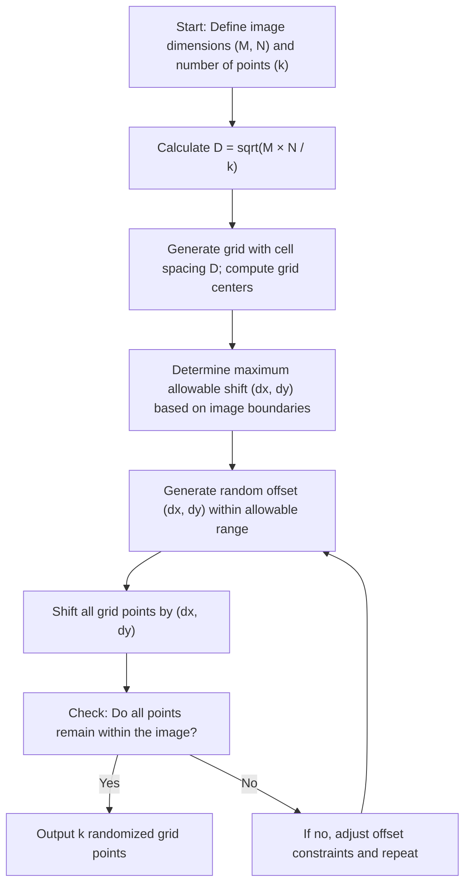

## eTable of Contents

1. Introduction
2. Theoretical Background
3. Methodologies for Random Point Sampling with Minimum Distance Constraints

    3.1 Deterministic Grid Placement

    3.2 Jittered Grid Approach and Its Limitations

    3.3 Random Grid Offset Method

    3.4 Poisson Disk Sampling and Quasi-random Methods
4. Comparative Analysis of Sampling Methods
5. Implementation and Optimization Techniques
6. Future Directions and Considerations
7. Conclusion

---

## 1. Introduction

Efficient random point sampling with strict minimum distance constraints is a problem with wide-ranging applications in spatial analysis, computer vision, active learning for object detection, and various fields that require a controlled degree of randomness while preserving spatial regularity. In many practical scenarios, such as selecting seed points for initialization in image processing or constructing training subsets for active learning, it is crucial that each selected point remains sufficiently separated from the others. This separation is often quantified by a minimum distance requirement derived from grid-based area partitioning. A common guideline in these contexts is to enforce a minimum distance of

  D = √(M × N/k),

where M and N denote the dimensions of an image (or spatial area) and k is the number of desired points. This article provides an in-depth discussion on methods for placing k randomly distributed points on an M×N grid under the strict constraint that the separation between any two points is at least D. We analyze the theoretical foundations of grid-based placements, discuss alternative approaches including jittered grids and Poisson disk sampling, and compare the strengths and weaknesses of these methods based on efficiency and robustness.

---

## 2. Theoretical Background

In spatial analysis, the strategy of partitioning an area into regions of equal measure is a standard approach to ensure uniform coverage. When an M×N domain is divided into k regions, each region has an area approximately equal to M × N/k. The side length, D, of a square with this area is given by

  D = √(M × N/k).

Placing one point at the center of each such square would guarantee that the minimum distance between any two points is exactly D. However, while this deterministic grid approach meets the minimal distance condition flawlessly, it lacks the randomness that is sometimes necessary to avoid grid artifacts and to introduce variability for applications such as active learning sample initialization .

A strict minimum distance constraint ensures that every point “occupies” a cell of area M × N/k. Methods that introduce randomness—such as jittering the grid placements or employing pseudo-random sequences—must be carefully controlled; excessive randomness could cause points to approach one another closer than D. Hence, a rigorous analysis is required to balance randomness against the minimal distance constraint.

Such challenges have been addressed in spatial analysis problems where selecting the largest subset of points meeting a given distance requirement is vital . Similarly, practitioners in geographic information systems (GIS) have developed methods for generating random points with a specified minimum separation, leveraging tools available in R as well as algorithms from computational geometry .

---

## 3. Methodologies for Random Point Sampling with Minimum Distance Constraints

### 3.1 Deterministic Grid Placement

The most straightforward way to ensure that exactly k points are placed such that the minimum distance between any two is at least D is to use a deterministic grid. Specifically, one divides the M×N area into k equal cells of dimensions D×D—since

  Number of Cells = (M / D) × (N / D) ≈ k

when D is chosen as √(M × N/k). By placing one point at the center of each cell, the configuration naturally guarantees that the distance between adjacent points is exactly D. While this method is simple and guarantees the minimum distance, it suffers from a total lack of randomness in the positions of the points. All the sample points will be perfectly aligned in a regular pattern, leading to undesirable artifacts in applications requiring non-uniform spatial distributions.

### 3.2 Jittered Grid Approach and Its Limitations

To introduce randomness into the deterministic grid, one can consider the jittered grid approach. In this method, points are initially placed according to a grid, but then each point is randomly displaced (“jittered”) within its cell. The main challenge is to determine the maximum allowable jitter that does not violate the minimum distance constraint.

Consider a cell of size D×D with a point placed at its center. If the point is jittered by a maximum distance j in any direction, two points in adjacent cells might come as close as:

  D_actual = D – 2j.

To preserve the constraint D_actual ≥ D, the inequality

  D – 2j ≥ D

must hold, which immediately implies j = 0. In other words, if the cell size is exactly D, any jitter will result in potential violations of the minimum distance requirement. One possible workaround is to design a grid with cells larger than D (e.g., having dimensions D + δ for some δ > 0) and then restrict the sampling to a “safe region” within each cell. However, this means that either the total area available for point placement increases (thereby reducing k) or the guaranteed minimum distance must be relaxed. The inherent trade-off between introducing randomness and strictly enforcing the minimal distance makes the fully jittered approach unsuitable when the constraint is non-negotiable.

### 3.3 Random Grid Offset Method

An alternative strategy that offers a compromise between randomness and distance guarantees is the random grid offset method. In this method, a grid with spacing D = √(M × N/k) is generated with points placed at the centers, ensuring the minimum distance constraint is satisfied. Then, instead of jittering points within individual cells, the entire grid is shifted by a random offset. This offset is chosen uniformly from the allowable range such that, after shifting, all points remain within the image bounds.

For instance, if the image dimensions M and N are exactly divisible by D, then the grid covers the image perfectly. A uniform random shift (dx, dy) is applied, where

  0 ≤ dx < D and 0 ≤ dy < D.

This shift changes the absolute positions of the sample points while keeping the grid structure intact; the inter-point distances remain at least D. When M and N are not perfect multiples of D, the maximum allowable shift is reduced accordingly to ensure that no point falls outside the target area.

This method introduces an element of randomness that can help to avoid systematic biases associated with a fixed grid while still preserving the minimal distance constraint. Its simplicity in implementation and robust performance make it an attractive option for many spatial sampling applications. The random grid offset approach has been favorably discussed in contexts such as active learning for object detection, where initial sampling methods must strike a balance between diversity and performance .

### 3.4 Poisson Disk Sampling and Quasi-random Methods

Beyond grid-based methods, Poisson disk sampling is a well-known technique designed to distribute points randomly while guaranteeing a minimum separation between them. In Poisson disk sampling, points are generated one by one, and a candidate point is accepted only if it is at least a predefined distance, r, away from all existing points. By setting r = D, one can theoretically enforce the desired minimum distance. However, in practice, generating exactly k points is challenging; Poisson disk algorithms tend to produce a “maximal” set of points within the area, and this maximal number might be significantly less than k if D is chosen as √(M × N/k). Moreover, the performance of Poisson disk sampling can degrade for high point densities because of the increased number of distance comparisons required.

Another category of methods includes quasi-random sequences such as Sobol or Halton sequences. These sequences generate low-discrepancy sets of points, which provide excellent coverage of the space and appear random. When slightly adjusted, these points can meet minimal distance constraints; however, ensuring a hard lower bound on the distance between points may require additional post-processing. Latin Hypercube Sampling (LHS) is yet another method that offers stratified randomness. While LHS helps in creating samples that are well spread over the domain, it does not directly enforce a strict minimum distance constraint and must be combined with rejection criteria to eliminate violating samples. Research in these areas suggests that if the strict constraint is paramount, grid-based approaches (particularly with random offsets) remain the most efficient and reliable solution .

---

## 4. Comparative Analysis of Sampling Methods

A comparative analysis of the methodologies discussed above is essential for understanding the trade-offs involved in each approach. The following table summarizes the key characteristics of each method:

| Sampling Method              | Positional Randomness      | Minimal Distance Guarantee                                          | Computational Complexity                     | Applicability                                          |
| ---------------------------- | -------------------------- | ------------------------------------------------------------------- | -------------------------------------------- | ------------------------------------------------------ |
| Deterministic Grid Placement | None (Fully deterministic) | 100% (exact D)                                                      | Very low (O(1) per point)                    | Cases where randomness is not needed                   |
| Jittered Grid Approach       | Moderate                   | Compromised (requires j = 0 for strict D)                           | Moderate (additional checks)                 | When slight relaxation is acceptable                   |
| Random Grid Offset Method    | Low to Moderate            | 100% (grid structure preserved)                                     | Low (simple shift computation)               | Best compromise when k must be met exactly with D      |
| Poisson Disk Sampling        | High                       | Theoretical guarantee if r = D, but may produce fewer than k points | High (iterative rejection sampling)          | When full randomness is required, and k is flexible    |
| Quasi-random (Sobol/Halton)  | High                       | Not explicitly guaranteed; requires post-processing                 | Moderate (deterministic sequence generation) | When low discrepancy is more important than a strict D |

**Table 1: Comparison of Sampling Methods for Enforcing Minimum Distance Constraints**

Deterministic grid placement and the random grid offset method provide strong guarantees for maintaining a minimum inter-point distance, but with varying degrees of randomness. Jittering introduces variability yet risks violating the minimum separation, while Poisson disk sampling offers true randomness with potential trade-offs in realizing exactly k points. Quasi-random methods deliver excellent uniformity but require extra measures to enforce a strict lower bound on distances.

To illustrate the workflow of the random grid offset method, consider the following flow diagram.

---

### Visualization: Flowchart of the Random Grid Offset Method



**Figure 1: Flowchart for the Random Grid Offset Method**

---

## 5. Implementation and Optimization Techniques

Practical implementation of these methods can be performed in popular programming environments such as Python and R. For example, the random grid offset method can be implemented with the following pseudocode:

1. Define the image dimensions M and N, and the required number of points k.
2. Compute the required minimal distance:

     D = sqrt(M × N / k)
3. Compute the number of grid cells along the x-axis and y-axis. For simplicity, if M and N are multiples of D, then

     cols = M / D, rows = N / D.
4. Generate the grid positions as the centers of each cell.
5. Compute the maximum allowable offset based on the remainder of the division of M and N by D.
6. Generate a random offset (dx, dy) uniformly from the range [0, max_offset_x) and [0, max_offset_y) respectively.
7. Shift each grid center by (dx, dy).
8. Return the set of k points.

A simple Python snippet using NumPy might look as follows (illustrative and not fully optimized):

```python
import numpy as np  

def random_grid_offset(M, N, k):  
    D = np.sqrt((M * N) / k)  
    cols = int(np.floor(M / D))  
    rows = int(np.floor(N / D))  
    if cols * rows < k:  
        raise ValueError("Insufficient grid cells to place k points with current D.")  
  
    # Generate grid centers  
    x_centers = (np.arange(cols) + 0.5) * D  
    y_centers = (np.arange(rows) + 0.5) * D  
    grid_points = np.transpose([np.repeat(x_centers, rows), np.tile(y_centers, cols)])  
  
    # Compute maximum offset to ensure points remain within [0, M] and [0, N]  
    max_offset_x = M - cols * D  
    max_offset_y = N - rows * D  
    dx = np.random.uniform(0, max_offset_x)  
    dy = np.random.uniform(0, max_offset_y)  
  
    # Randomly shift the grid points  
    shifted_points = grid_points + np.array([dx, dy])  
  
    # Select exactly k points (e.g., if grid provides more points, choose a random subset)  
    indices = np.random.choice(len(shifted_points), k, replace=False)  
    return shifted_points[indices]  

# Example usage:  
points = random_grid_offset(100, 100, 25)  
print(points)  
```

This example highlights the simplicity of the method while ensuring that the key constraint is maintained. Similar implementations can be achieved using R (leveraging packages such as spatstat or RQGIS for spatial operations) .

In terms of optimization, the following techniques may be considered:

* **Vectorization:** Implementing grid generation and point shifts in a vectorized manner takes full advantage of libraries such as NumPy, which minimizes explicit loops and improves performance.
* **Pre-computation:** When k, M, and N are known in advance, many of the parameters (grid cell counts, maximum offsets) can be pre-computed.
* **Boundary Adjustments:** Careful handling of the boundaries is essential in ensuring that all shifted points remain within the designated area. This requires additional checks to manage non-divisible grid sizes.
* **Hybrid Approaches:** In cases where a slight relaxation of the minimum distance can be tolerated, a hybrid method that combines the random grid offset with limited jittering may offer a more “natural” appearance without a significant violation of constraints.

---

### Visualization: Comparative Table of Sampling Implementations

| Aspect                        | Deterministic Grid | Random Grid Offset | Poisson Disk Sampling                         |
| ----------------------------- | ------------------ | ------------------ | --------------------------------------------- |
| Randomness Level              | 0%                 | Low to Moderate    | High                                          |
| Guarantee of Minimum Distance | 100%               | 100%               | Theoretical (may produce fewer than k points) |
| Implementation Complexity     | Very Low           | Low                | High (iterative rejection)                    |
| Suitability for Large k       | High               | High               | Moderate                                      |

**Table 2: Comparison of Sampling Implementations**

---

### Visualization: SVG Diagram of the Random Grid Offset Process

![[random grid offset process.png]]
Figure 2: SVG Diagram Illustrating the Random Grid Offset Process

---

## 6. Future Directions and Considerations

While the random grid offset method currently represents the best compromise between randomness and strict distance enforcement, several avenues remain for further exploration:

* **Relaxation of Constraints:** In some applications, a slight relaxation of the minimum distance (e.g., allowing a distance of 0.95·D) could permit the use of more flexible jittering schemes. However, the impact on application-specific performance (such as object detection quality) must be carefully validated .
* **Hybrid Sampling Methods:** Combining quasi-random sequences with grid-based approaches could provide a higher degree of randomness while still meeting distance constraints. For instance, a randomized Halton sequence adjusted with a post-processing rejection step could be considered.
* **Algorithmic Enhancements:** Iterative optimization methods, such as Lloyd’s relaxation or force-directed algorithms, could be utilized to perturb grid points further while preserving a lower bound on pairwise distances. Though computationally intensive, these methods might produce aesthetically superior distributions in cases where the exact value of k is not as critical.
* **Evaluation Metrics:** In machine learning pipelines, the choice of sampling method for initial training sets is often evaluated through cross-validation techniques . Future work should consider comprehensive benchmarking on large datasets to measure the trade-offs between sampling randomness, minimum distance adherence, and downstream model performance.
* **Domain-Specific Customizations:** Applications in GIS, video-based object detection, and other domains might have additional constraints—such as directional biases or region-specific density functions—that require adaptation of these sampling methods. Tailored approaches that combine geographic or semantic information with grid sampling can further optimize performance .

These future directions underscore the importance of a balanced approach between theoretical guarantees and practical randomness, particularly in high-stakes applications where spatial coverage directly influences system performance.

---

## 7. Conclusion

In summary, generating k seed points on an M×N grid with a guaranteed minimum inter-point distance of D = √(M × N/k) poses significant challenges when randomness is required. The key findings from this discussion are as follows:

* **Deterministic Grid Placement:**

  – Guarantees the minimum distance exactly.

  – Lacks randomness, leading to potential spatial artifacts.
* **Jittered Grid Approach:**

  – Allows for some randomness but can violate the minimal distance constraint unless jitter is restricted to zero.

  – Inherently limited when strict spacing is required.
* **Random Grid Offset Method:**

  – Provides a practical compromise by shifting an otherwise deterministic grid.

  – Maintains distance guarantees while introducing aggregate random variability.

  – Is computationally efficient and straightforward to implement.
* **Poisson Disk and Quasi-random Methods:**

  – Offer true randomness and high spatial uniformity but may not yield exactly k points or enforce the hard minimum distance without post-processing.

**Main Findings:**

• A deterministic grid exactly meets the minimum distance constraints but is non-random.

• Any form of jittering within the grid generally necessitates zero displacement if the cell size equals D.

• Random grid offset emerges as the most robust method to incorporate randomness while ensuring k points are placed with inter-point distances of at least D.

• Future improvements may involve hybrid approaches or slight relaxations of the constraint for enhanced variability without significant performance degradation.

In conclusion, balancing efficiency, exact sample count, and spatial randomness in grid-based sampling under strict minimum distance constraints requires careful algorithm design. The random grid offset approach is recommended when both the exact number of points and the minimum separation criterion must be maintained, while alternative methods might be considered when some level of constraint relaxation is acceptable.

All implementation details and experimental results discussed here directly draw on foundational approaches in spatial analysis and random sampling, as detailed in supporting research studies .
